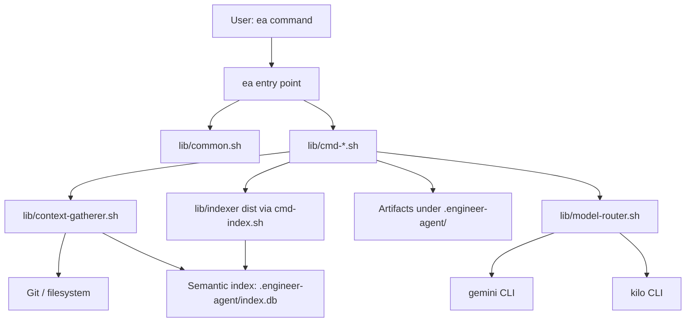
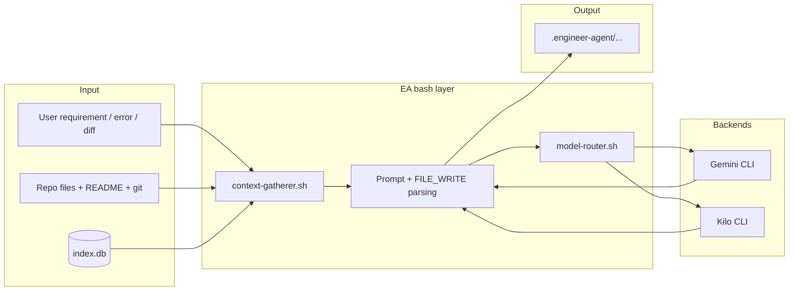

# Architecture Overview

The Engineer Agent (EA) is a bash-first CLI that orchestrates **`ea`**, shared libraries under **`lib/`**, optional **Node.js** tooling for semantic indexing, and external AI CLIs (**Gemini**, **Kilo**). **Cursor** is not invoked by bash; it is where you **consume** artifacts such as **`tasks.md`** and **`debug-brief.md`**.

## Hub-and-spoke diagram



## Data flow



- **Planning / ship (plan)** — **`get_planning_context`** merges README, optional RAG from **`index.db`**, repo structure, language hints, git summary, then the requirement text → **Gemini** (default).  
- **Fix / ship (execute) / review / …** — Smaller, task-specific prompts; routing via **`route_task`** / **`call_model`** → **Kilo** or **Gemini** with CLI fallbacks.

## Tooling integration

| Layer | Role |
|-------|------|
| **Shell** | `ea` dispatches to **`lib/cmd-*.sh`**; **`detect_project_root`** ties commands to one repo. |
| **Gemini CLI** | Headless `gemini -p` for large-context planning and fallbacks. |
| **Kilo CLI** | `kilo run --auto --agent <mode>` for code / debug / architect modes. |
| **Node** | Only **`ea index`**: **`lib/indexer/dist/index.js`** for crawl, embed, SQLite. |
| **Cursor IDE** | Reads **`tasks.md`**, **`debug-brief.md`**, fix output — **not** called by EA scripts. |

## Loop closure with Cursor (`tasks.md` bridge)

```mermaid
flowchart LR
    U[Developer] -->|ea plan "..."| EA[ea CLI]
    EA -->|writes| T[tasks.md in timestamped _plan/]
    EA -->|writes| L[latest-plan.txt]
    U -->|open repo in Cursor| C[Cursor Agent / Composer]
    T --> C
    L --> T
    C -->|implements steps| REPO[Repository]
```

**`tasks.md`** is the handoff: the CLI produces a **Cursor-ready** checklist under **`.engineer-agent/YYYYMMDD_HHMMSS_plan/`**; you point the editor at that file (or follow **`latest-plan.txt`**) so the IDE agent executes the same plan EA generated.

## Core modules

| Path | Role |
|------|------|
| `ea` | Entry point; sources `lib/common.sh` and all `lib/cmd-*.sh` |
| `lib/common.sh` | Config paths (`~/.ea`), `call_gemini`, `call_kilo`, `route_task`, `call_model`, prompts, `FILE_WRITE` parsing, `make_ea_output_dir` |
| `lib/model-router.sh` | Resolves `--model`, maps to backend, implements `call_model` |
| `lib/context-gatherer.sh` | `get_planning_context`, git/import/symbol helpers, **optional semantic block** |
| `lib/cmd-*.sh` | One file per subcommand (`plan`, `ship`, `fix`, `debug`, `index`, …) |

## Semantic indexing (RAG)

- **`lib/indexer/`** — TypeScript package: crawl → chunk → **Gemini embeddings** (default `gemini-embedding-001`) → SQLite.
- **`lib/cmd-index.sh`** — `ea index` / `ea index search`; ensures `npm install` + `npm run build` in `lib/indexer/`.
- **Storage**: `.engineer-agent/index.db` (+ SQLite WAL/SHM alongside).
- **Retrieval**: During **`get_planning_context`**, if the DB exists, **`jq`** is available, and **`GEMINI_API_KEY`** / **`GOOGLE_API_KEY`** is set, EA runs the indexer **`search`** subcommand and injects **Relevant Code Context** into the planning blob.

See **[SEMANTIC_INDEXING.md](SEMANTIC_INDEXING.md)** and **[CONTEXT_ENGINE.md](CONTEXT_ENGINE.md)**. Per-command write-ups (plan, ship, fix, debug, index) are listed in **[README.md](README.md)**.

## Artifacts

- **Per run**: `.engineer-agent/YYYYMMDD_HHMMSS_<keyword>/` — directory name from **`make_ea_output_dir`** in **`lib/common.sh`**: `ts="$(date +%Y%m%d_%H%M%S)"` → **`${ts}_${keyword}`** (e.g. `*_plan/`, `*_ship-plan/`, `*_fix/`, `*_debug/`).
- **Pointers**: `latest-plan.txt`, `latest-ship-plan.txt`, `latest-fix.txt`, `latest-debug.txt` (each one line = absolute path to the latest run directory).

## External backends

| Backend | Typical use | Notes |
|---------|-------------|--------|
| **Gemini CLI** | `ea plan`, planning phases, `call_gemini` | Headless `gemini -p`; tool availability depends on CLI mode |
| **Kilo CLI** (`@kilocode/cli`, binary `kilo`) | `ea fix`, `ea ship` execute, etc. | `kilo run --auto --agent …` |

---

*Last updated: 2026-03-22*
