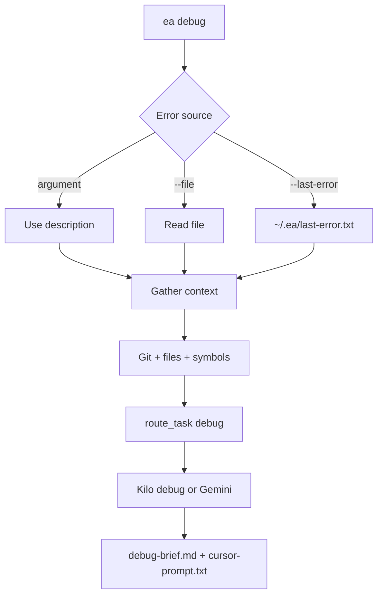

# Command: `ea debug`

Analyzes an error with **Kilo** (DeepSeek R1 debug mode) by default, or **Gemini** with **`--backend gemini`**. Produces a **debug brief** and **Cursor-oriented prompt** text.

## Usage

```bash
ea debug [ERROR_DESCRIPTION] [--file LOG_FILE] [--last-error] [--path PATH] [--open] [--backend gemini|kilo]
```

## Workflow



## Context gathering

1. **Git** — recent commits / diff where useful  
2. **Paths in error** — file:line references  
3. **Symbol search** — `rg` / `grep` for definitions  
4. **Optional file reads** — snippets from stack traces  

**Note:** Unlike **`ea plan`**, **`ea debug`** does **not** use **`get_planning_context`** or the **semantic index** today. (Semantic RAG is planning-focused.)

## Artifacts

| File | Description |
|------|-------------|
| `.engineer-agent/{ts}_debug/debug-brief.md` | Analysis + suggested fix |
| `.engineer-agent/debug-brief.md` | Convenience copy |
| `.engineer-agent/{ts}_debug/cursor-prompt.txt` | Paste into Cursor |

## Routing

| Condition | Backend |
|-----------|---------|
| Default | Kilo (`call_kilo_debug`) |
| `--backend gemini` | Gemini |

## Examples

```bash
ea debug "TypeError: Cannot read property 'id' of undefined"
ea debug --file /tmp/build.log
ea debug --last-error
ea debug --last-error --open
```

## Edge cases

| Scenario | Handling |
|----------|----------|
| No error text | Error + usage |
| Kilo missing | Fallback to Gemini |
| Symbol noise | Filters common tokens |

---

*Last updated: 2026-03-22*
