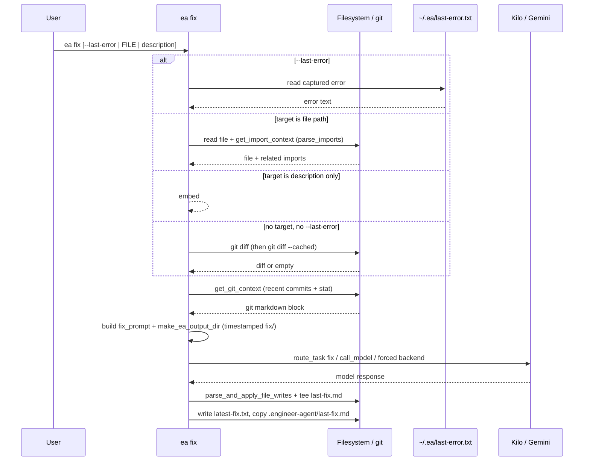

# Command: `ea fix`

Quick-fix a file, a **problem description**, **last captured error**, or **staged/unstaged git diff** context. Default routing prefers **Kilo** (code mode); **`--backend`** / **`--model`** can force a path. Implemented in **`lib/cmd-fix.sh`**.

## Usage

```bash
ea fix [FILE_OR_DESCRIPTION] [--last-error] [--path /path/to/project] [--open|--cursor] [--backend kilo|gemini] [--model MODEL]
```

## Sequence: error-to-edit pipeline

Typical reactive loop from failure to **`last-fix.md`**:



## Context aggregation (not semantic RAG)

- **`get_import_context`** / **`parse_imports`** — when the target is an existing file, local import closure is appended (TS/JS, Python, Go, Rust), subject to depth/file caps in **`context-gatherer.sh`**.  
- **`get_git_context`** — last N commits + diff stat (same helper as planning), when inside a git repo.  
- **Semantic index** — **`ea fix` does not** call **`get_planning_context`** or **`index.db`** today.

## Edge case: no file and no `--last-error`

If **`target`** is empty and **`--last-error`** is false, EA uses **`git diff`** then **`git diff --cached`**. If both are empty, it errors: *No target file, description, or diff found*.

## Output

- Timestamped dir: **`.engineer-agent/YYYYMMDD_HHMMSS_fix/`** (see **`make_ea_output_dir`** in **`lib/common.sh`**) containing **`last-fix.md`**.  
- **`.engineer-agent/latest-fix.txt`** — one line, absolute path to that directory.  
- **`.engineer-agent/last-fix.md`** — convenience copy of the latest fix output.

## Options (summary)

| Flag | Description |
|------|-------------|
| `--path` | Project root |
| `--last-error` | Use **`~/.ea/last-error.txt`** |
| `--backend gemini\|kilo` | Force backend |
| `--model MODEL` | Passed to **`call_model`** |
| `--open` / `--cursor` | Open fix output in editor |

## See also

- **[../CONTEXT_ENGINE.md](../CONTEXT_ENGINE.md)** — shared helpers (`get_git_context`, imports)  
- **[../ROUTING_MATRIX.md](../ROUTING_MATRIX.md)** — **`route_task` / `call_model`**  
- **[../STATE_MANAGEMENT.md](../STATE_MANAGEMENT.md)** — artifact paths  

---

*Last updated: 2026-03-22*
