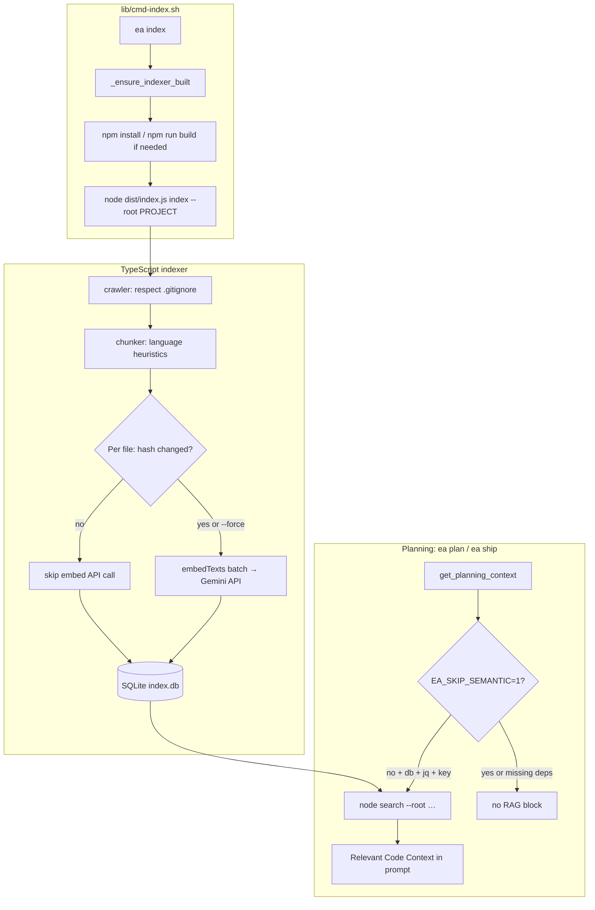

# Command: `ea index`

Builds or queries a **local semantic index** (SQLite + **Gemini embeddings**) used for **optional RAG** during **`ea plan`** / **`ea ship`** planning. Implemented by **`lib/cmd-index.sh`** and **`lib/indexer/`** (TypeScript).

## End-to-end flow (bash → Node → SQLite)



- **SHA-256** (per file) avoids re-embedding unchanged files on incremental **`ea index`** (unless **`--force`**).  
- **`EA_SKIP_SEMANTIC=1`** disables only the **planning-time** search injection — it does not change how **`ea index`** writes **`index.db`**.

## Usage

```bash
ea index [--path /path/to/project] [--force] [--quiet] [--exclude GLOB ...]
ea index search "natural language query" [--path /path/to/project] [--limit N]
```

## Environment

| Variable | Required | Purpose |
|----------|----------|---------|
| `GEMINI_API_KEY` or `GOOGLE_API_KEY` | Yes (index + search) | Embedding API |

## Progress

Long runs are **normal** on the first index: you’ll see **`[ea-index]`** lines on **stderr** (which file, how many chunks, each embedding batch). The bash wrapper prints a warning that first runs can take many minutes.

- **`EA_INDEX_QUIET=1`** or pass **`--quiet`** to the underlying CLI (see `lib/indexer`) to hide progress.

## What it does

### `ea index` (default)

1. Ensures **`lib/indexer/node_modules`** and **`dist/`** exist (`npm install`, `npm run build`).  
2. Runs **`node lib/indexer/dist/index.js index --root <project>`**.  
3. Writes **`.engineer-agent/index.db`** (and SQLite WAL/SHM files).  
4. Prints JSON: **`indexed`**, **`skipped`**, **`errors`**.

**Incremental:** Only files with changed content (SHA-256) are re-embedded.

**Dependency / install dirs** are always skipped (e.g. **`node_modules`**, Python **`site-packages`** / **`venv`** / **`.venv`**, Elixir **`deps`**, **`vendor`**, Rust **`target`**, CocoaPods **`Pods`**, …) in addition to **`.gitignore`**. See **[../SEMANTIC_INDEXING.md](../SEMANTIC_INDEXING.md)** for the full table. Extra patterns: **`ea index --exclude 'some/path/**'`** (repeatable).

### `ea index search "…"`

Runs **`search`** subcommand; prints JSON **`{ "hits": [ … ] }`** with paths, lines, scores, and snippet text. Useful for debugging retrieval without running a full plan.

## Planning integration

When **`index.db`** exists, **`jq`** is on `PATH`, and an API key is set, **`get_planning_context`** adds a **Relevant Code Context** section. Disable with **`EA_SKIP_SEMANTIC=1`**. Tune **`EA_SEMANTIC_LIMIT`** (default `5`).

## Options

| Flag | Description |
|------|-------------|
| `--path` | Project root (default: git root / cwd) |
| `--force` | Re-embed all files |
| `--quiet` | Hide indexer progress on stderr |
| `--exclude` | Extra fast-glob ignore (repeatable) |
| `--limit` | Search only: max hits (default `8`) |

## Examples

```bash
export GEMINI_API_KEY=...
ea index
ea index --force
ea index search "where is cmd-plan defined" --limit 5
```

## See also

- **[../SEMANTIC_INDEXING.md](../SEMANTIC_INDEXING.md)** — design and limitations  
- **[../CONTEXT_ENGINE.md](../CONTEXT_ENGINE.md)** — when context is injected  

---

*Last updated: 2026-03-22*
