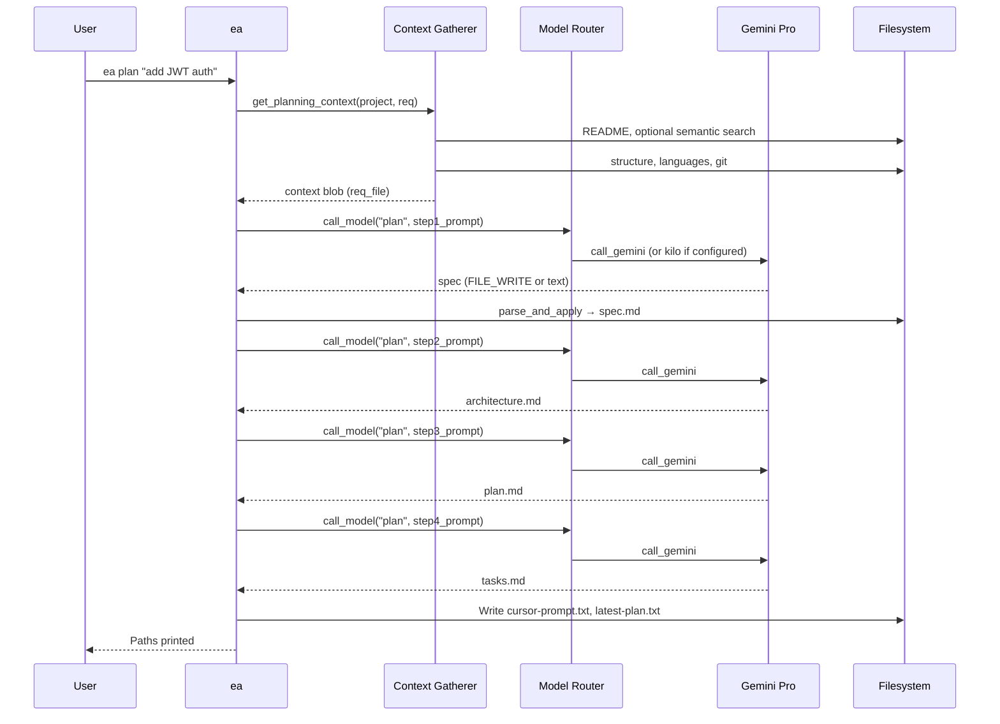

# Command: `ea plan`

Generates a full planning pack from a requirement: **spec → architecture → plan → tasks**, using **Gemini** by default (via **`call_model`** / **`route_task`**).

## Usage

```bash
ea plan "requirement text" [--path /path/to/project] [--open] [--cursor] [--model MODEL]
ea plan --req "requirement text" [--path /path/to/project]
```

## Workflow



## Four-phase process

### Phase 1: Requirement → Specification
- **Input**: Raw requirement + **`get_planning_context`** output (README, optional **semantic RAG**, structure, git, requirement).  
- **Prompt**: `prompts/rephrase.md`  
- **Output**: `spec.md`  

### Phase 2: Specification → Architecture
- **Input**: `spec.md`  
- **Prompt**: `prompts/architect.md`  
- **Output**: `architecture.md`  

### Phase 3: Architecture → Implementation plan
- **Input**: `spec.md` + `architecture.md`  
- **Prompt**: `prompts/senior-swe.md`  
- **Output**: `plan.md`  

### Phase 4: Plan → Tasks
- **Input**: `plan.md`  
- **Prompt**: `prompts/senior-swe.md`  
- **Output**: `tasks.md`  

## Artifacts

| File | Description |
|------|-------------|
| `.engineer-agent/{ts}_plan/spec.md` | Engineering specification |
| `.engineer-agent/{ts}_plan/architecture.md` | ADR |
| `.engineer-agent/{ts}_plan/plan.md` | Implementation plan |
| `.engineer-agent/{ts}_plan/tasks.md` | Cursor-ready tasks |
| `.engineer-agent/{ts}_plan/cursor-prompt.txt` | Paste into Cursor |
| `.engineer-agent/latest-plan.txt` | Path to latest plan directory |

## Options

| Option | Description |
|--------|-------------|
| `--path` | Project root override |
| `--open` / `--cursor` | Open `tasks.md` in editor after run |
| `--model` | Force model preference (`gemini-pro`, `kilo`, `auto`, …) |

## Semantic RAG (optional)

If **`ea index`** has been run and **`index.db`** exists, planning context can include **Relevant Code Context**. See **[../SEMANTIC_INDEXING.md](../SEMANTIC_INDEXING.md)**.

## Examples

```bash
ea plan "add JWT authentication to the API"
ea plan "add dark mode" --cursor
ea plan --req "refactor auth" --path /path/to/project
```

## Edge cases

| Scenario | Handling |
|----------|----------|
| Empty requirement | Error + usage |
| Gemini unavailable | Fallback to Kilo (architect mode) where possible |
| No semantic index | Planning still runs; no RAG block |
| `FILE_WRITE` in LLM output | Applied under project root; rest echoed |

---

*Last updated: 2026-03-22*
