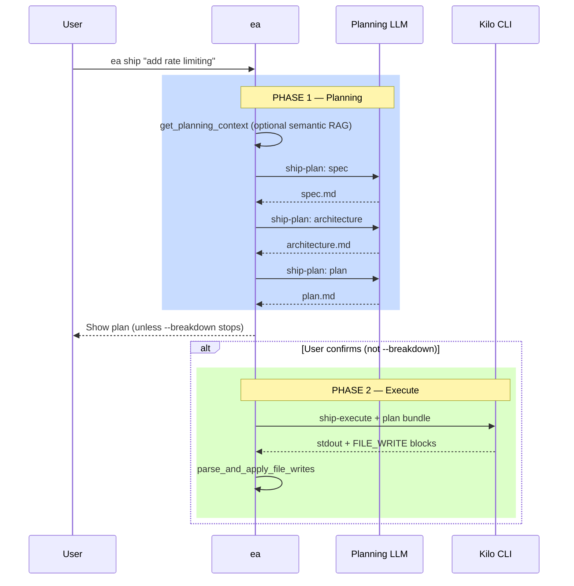

# Command: `ea ship`

Two phases: **Gemini** (or routed model) produces **spec / architecture / plan**; **Kilo** executes the plan with **`FILE_WRITE`** parsing.

## Usage

```bash
ea ship "feature description" [--breakdown] [--step] [--path /path/to/project]
```

## Two-phase workflow



## Phase 1: Planning

Same sources as **`ea plan`**: **`get_planning_context`** (README, optional semantic index, structure, git, requirement). Outputs go to **`.engineer-agent/{ts}_ship-plan/`**.

## Phase 2: Execution

1. Build prompt from **plan.md**, **spec.md**, **architecture.md**.  
2. **`route_task "ship-execute"`** → **`call_kilo`** (default) or Gemini fallback.  
3. **`parse_and_apply_file_writes`** applies fenced **`FILE_WRITE`** blocks.

## Step mode (`--step`)

Prompts before each **`FILE_WRITE`** block (`y` / `n` / `s`).

## Options

| Option | Description |
|--------|-------------|
| `--breakdown` | Plan only; no execution |
| `--step` | Confirm each write |
| `--path` | Project root |

## Artifacts

| File | Description |
|------|-------------|
| `.engineer-agent/{ts}_ship-plan/spec.md` | Spec |
| `.engineer-agent/{ts}_ship-plan/architecture.md` | ADR |
| `.engineer-agent/{ts}_ship-plan/plan.md` | Plan |
| `.engineer-agent/latest-ship-plan.txt` | Latest ship-plan dir |

## Routing

| Phase | Default backend |
|-------|-----------------|
| Plan | Gemini (via `route_task "ship-plan"`) |
| Execute | Kilo |

## Examples

```bash
ea ship "add rate limiting to API"
ea ship "dark mode" --breakdown
ea ship "payments" --step
```

## Edge cases

| Scenario | Handling |
|----------|----------|
| User declines at prompt | Plan kept; no Kilo run |
| Kilo missing | Fallback to Gemini for execute if available |
| Non-interactive stdin | Skips confirmation where implemented |

---

*Last updated: 2026-03-22*
