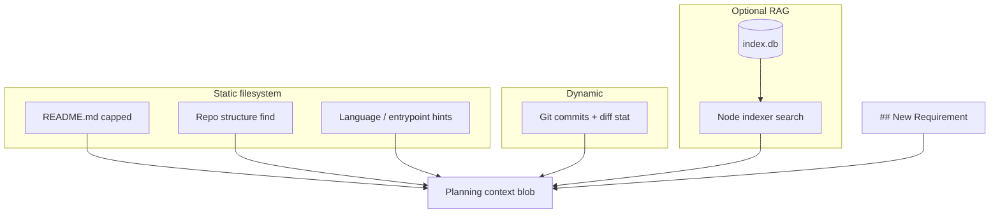

# Context Engine

The context engine (**`lib/context-gatherer.sh`**) assembles a single markdown blob for planning and provides helpers for **review**, **fix**, and **debug**.

## Aggregation: inputs → one context blob

For **`get_planning_context`**, multiple sources are merged **in order** into one markdown string passed to the planner. Optional semantic retrieval adds another vector-backed input:



- **Static** — README (if present), **`find`**-based structure (heavy dirs excluded), extension counts + manifest paths.  
- **Dynamic** — **`get_git_context`**: recent commits + **`git diff … --stat`** when history exists.  
- **RAG** — **`append_semantic_planning_context`**: query embedding + cosine search over chunks; skipped if DB missing, no **`jq`**, no API key, or **`EA_SKIP_SEMANTIC=1`**.

**Other commands** (**`ea fix`**, **`ea debug`**, etc.) compose **smaller** prompts: they use subsets (e.g. **`get_git_context`**, **`parse_imports`**, **`search_symbols`**) but **not** the full **`get_planning_context`** pipeline unless explicitly wired.

## Planning: `get_planning_context`

Used by **`ea plan`** and **`ea ship`** (phase 1). Signature:

```bash
get_planning_context PROJECT_ROOT REQUIREMENT_TEXT
```

Output is **ordered** and **capped** (see env vars below).

### Section order

1. **README** (if `README.md` exists) — capped by `README_MAX_LINES` (default 200).
2. **Semantic retrieval (optional)** — if `.engineer-agent/index.db` exists, **`jq`** is installed, **`GEMINI_API_KEY`** or **`GOOGLE_API_KEY`** is set, and **`EA_SKIP_SEMANTIC`** is not `1`. Calls the Node indexer: `node …/lib/indexer/dist/index.js search --root … --limit $EA_SEMANTIC_LIMIT`. Inserts **## Relevant Code Context (semantic retrieval)**. See **[SEMANTIC_INDEXING.md](SEMANTIC_INDEXING.md)**.
3. **Repo structure** — `find` at depth 2, excludes heavy dirs (`node_modules`, `dist`, `.git`, …), capped by `STRUCTURE_MAX_LINES`.
4. **Language / entrypoint hints** — extension counts + common manifests (`package.json`, `go.mod`, …).
5. **Git** — last N commits + diff stat (`get_git_context`), if inside a git repo with history.
6. **## New Requirement** — the user’s requirement text (always last).

### Token-conscious capping (edge cases)

| Variable | Default | Effect if exceeded / empty |
|----------|---------|----------------------------|
| `README_MAX_LINES` | 200 | Only first N lines of README are included; rest omitted. |
| `STRUCTURE_MAX_LINES` | 80 | Structure listing truncated after N lines. |
| `ENTRYPOINT_MAX_LINES` | 20 | Caps lines shown for entrypoint/manifest discovery. |
| `EA_SEMANTIC_LIMIT` | 5 | Max semantic **hits** injected (each hit is a chunk with path + body). |
| `EA_SKIP_SEMANTIC` | unset | Set to **`1`** → **no** RAG section; no embedding API call for search. |

If **`jq`** is missing, the semantic block is **skipped** (JSON formatting for hits requires **`jq`**). If **`index.db`** is missing, semantic step is a no-op.

### Environment tuning

| Variable | Default | Meaning |
|----------|---------|---------|
| `README_MAX_LINES` | 200 | Max lines from README |
| `STRUCTURE_MAX_LINES` | 80 | Max lines for structure listing |
| `ENTRYPOINT_MAX_LINES` | 20 | Max manifest/entrypoint paths |
| `EA_SEMANTIC_LIMIT` | 5 | Max semantic chunks injected |
| `EA_SKIP_SEMANTIC` | unset | Set to `1` to disable semantic block |

## Other helpers (not in `get_planning_context` by default)

### Import parsing (`parse_imports`)

Traverses local imports for dependency hints (TS/JS, Python, Go, Rust). **`MAX_DEPTH`**, **`MAX_FILES`** limit explosion.

### Symbol search (`search_symbols`)

Used in debug flows: finds symbols mentioned in errors (`rg`/`grep`).

### Git helpers

- `get_git_context` — commits + stat diff  
- `get_changed_files` — recent file lists  

## Related files

- `lib/context-gatherer.sh` — implementation  
- `lib/cmd-plan.sh`, `lib/cmd-ship.sh` — call `get_planning_context`  
- `lib/indexer/` — semantic index build + search CLI  

---

*Last updated: 2026-03-22*
