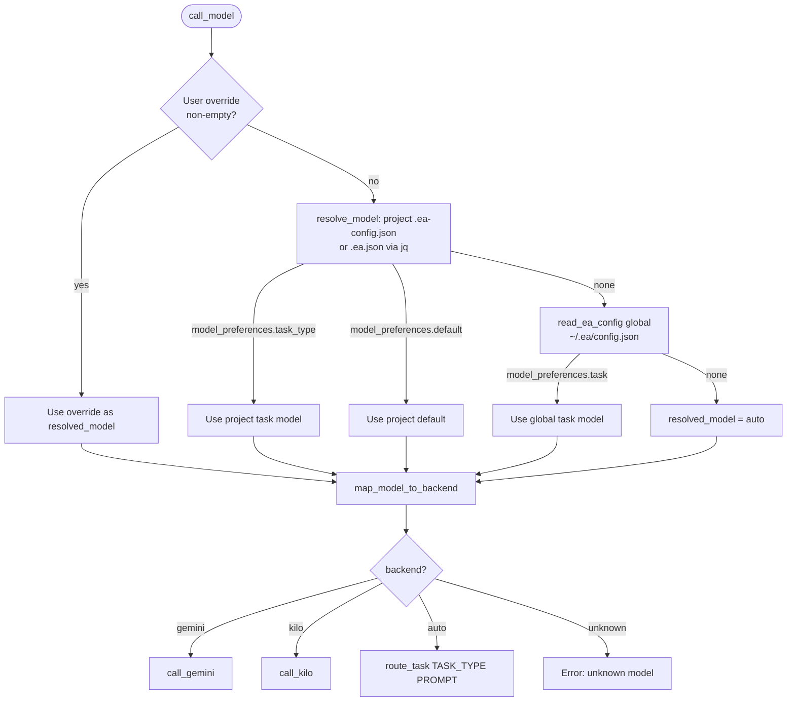
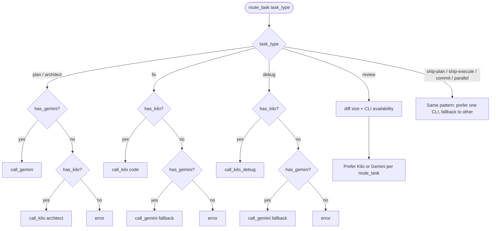

# Routing Matrix

Backend selection for LLM tasks is implemented in **`lib/model-router.sh`** (`resolve_model`, `map_model_to_backend`, `call_model`, `route_task`). **`ea index`** does **not** use this router for chat models — it runs a **separate Node.js** process that calls the **Gemini Embeddings API** only.

## `call_model`: resolution flowchart

Commands that pass a user model (e.g. **`--model`**) call **`call_model TASK_TYPE PROMPT [USER_MODEL_OVERRIDE]`**. Resolution order:

**Note:** **`resolve_model`** reads project config using **`get_project_config "$(pwd)"`** — i.e. **current working directory**, not always an explicit **`--path`**. Prefer running **`ea`** from the project root or **`cd`** there when using **`.ea-config.json`**.

## `route_task`: preferred backend + CLI fallbacks

When **`resolved_model`** is **`auto`** (or routing bypasses **`call_model`** and calls **`route_task`** directly), **`lib/common.sh`** chooses backend by **task type**, then checks **`has_gemini` / `has_kilo`**:

**Fallback summary:** If the **preferred** CLI is missing, EA tries the **other** when the task allows it (see **`route_task`** cases in **`lib/common.sh`**). If **neither** exists → error with install hint.

## Embeddings (`ea index`)

- **Not** routed through **`route_task`**.  
- Implemented in **`lib/indexer/`** (TypeScript): **`gemini-embedding-001`** (default; **`EA_EMBEDDING_MODEL`**) via Google Generative Language API.  
- Requires **`GEMINI_API_KEY`** or **`GOOGLE_API_KEY`** in the environment.

## Config extras

- **`.ea-config.json`** / **`.ea.json`** may define **`routing_rules`** (e.g. **`file_size_gt`**) in **`apply_routing_rules`** — today **`call_model`** does **not** invoke **`apply_routing_rules`**; rules are available for extension.  
- **`~/.ea/config.json`** holds global **`model_preferences`** read by **`resolve_model`**.

## Custom routing rules

`~/.ea/config.json` (or project config) may define `routing_rules`. See **`lib/model-router.sh`** for supported rule types.

---

*Last updated: 2026-03-22*
