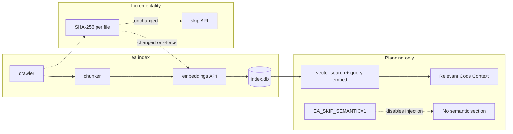

# Semantic Indexing & RAG

EA can attach **retrieved code chunks** to planning prompts using a **local** SQLite index and **Gemini embeddings** (default `models/gemini-embedding-001`; override with **`EA_EMBEDDING_MODEL`**). No third-party vector DB is required.

## Pipeline diagram



## Flow

1. **`ea index`** — Crawl project (built-in excludes for **package installs** + **virtualenvs** + build trees, **plus** root **`.gitignore`**), **chunk** files, **embed** chunks via API, store in **`.engineer-agent/index.db`**.  
2. **`ea plan` / `ea ship` (planning)** — **`get_planning_context`** optionally runs **`ea-indexer search`** with the user requirement as the query and injects a **Relevant Code Context** section **after README, before repo structure**.  
3. **Incremental updates** — Re-running **`ea index`** only re-embeds files whose **SHA-256** changed.

## Requirements

- **Node.js** (18+) for `lib/indexer`  
- **`npm install` + `npm run build`** in `lib/indexer` (automated on first `ea index`)  
- **`GEMINI_API_KEY`** or **`GOOGLE_API_KEY`**  
- **`jq`** on `PATH` for JSON formatting of search results in bash (semantic block skipped if `jq` is missing)

## Commands

```bash
export GEMINI_API_KEY=...
ea index
ea index --force
ea index search "natural language query" --limit 5
```

## Progress and runtime

- First full index can take **many minutes** (one embedding API round-trip per batch of chunks; many files ⇒ many calls).
- **Free-tier quotas** (e.g. embedding request caps) can return **429**; the indexer **waits** using the API’s suggested **“retry in Ns”** when present, then retries. If you still see errors after retries, wait for quota reset, upgrade the plan, or run **`ea index`** again later for the remaining files.
- The indexer prints **`[ea-index]`** lines to **stderr** (file names, chunk counts, batch progress). **`ea`** shows a short warning before starting.
- **`EA_INDEX_QUIET=1`** or **`ea-indexer index --quiet`** hides stderr progress (stdout is still the final JSON summary).
- Files larger than **512 KiB** are skipped to avoid huge single-file embeds.

## Environment

| Variable | Purpose |
|----------|---------|
| `EA_SKIP_SEMANTIC=1` | Disable semantic injection in planning context |
| `EA_SEMANTIC_LIMIT` | Max chunks injected (default `5`) |
| `EA_INDEX_QUIET=1` | Hide indexer progress on stderr |

## Built-in path excludes (dependency / install trees)

These are always ignored in addition to **`.gitignore`** (so `node_modules`, `venv`, etc. stay out of the index even if someone removed them from gitignore). Extra globs: **`ea-indexer index --exclude 'pattern'`** (repeatable).

| Area | Patterns (examples) |
|------|---------------------|
| JS/TS | `node_modules`, `bower_components`, `.pnpm-store`, `.yarn/cache` |
| Python | `__pycache__`, `.venv`, `venv`, `site-packages`, `.tox`, `.eggs`, `*.egg-info`, `pip-wheel-metadata` |
| Elixir | `deps`, `_build` |
| Haskell Stack | `.stack-work` |
| iOS | `Pods` |
| Other | `.git`, `.engineer-agent`, `dist`, `build`, `.next`, `vendor`, `target`, `*.min.js` |

If you previously indexed without these rules, **delete** **`.engineer-agent/index.db`** (or run a fresh clone) so stale vectors from old paths are not returned by search; **`--force`** alone does not remove DB rows for paths that are no longer crawled.

## Implementation

| Component | Path |
|-----------|------|
| Indexer CLI | `lib/indexer/src/index.ts` → `dist/index.js` |
| SQLite schema | `lib/indexer/src/database.ts` |
| Chunking | `lib/indexer/src/chunker.ts` (heuristic + sliding window) |
| Embeddings | `lib/indexer/src/embeddings.ts` |
| Crawl / filter | `lib/indexer/src/crawler.ts` |
| Vector search | `lib/indexer/src/search.ts` |
| Bash wrapper | `lib/cmd-index.sh` |
| Planning hook | `append_semantic_planning_context` in `lib/context-gatherer.sh` |

## Scope

- **Planning only** — `ea fix` / `ea debug` do **not** automatically use the semantic index today (only `get_planning_context` is wired).  
- **Chunking** — Heuristic, not full Tree-sitter AST for all languages.

## Tests

```bash
./tests/rag_integration_test.sh
```

---

*Last updated: 2026-03-22*
